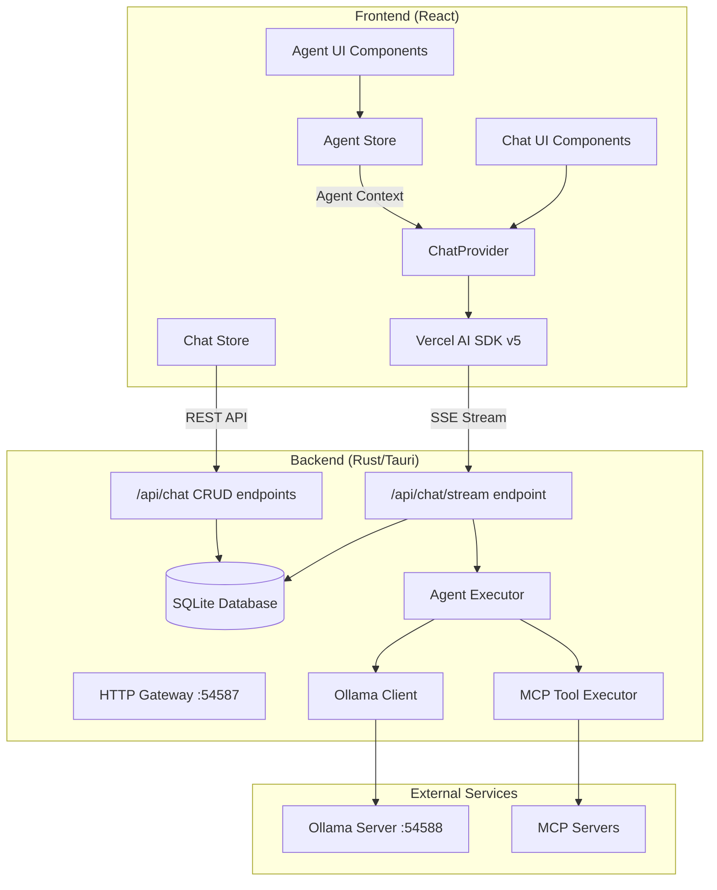
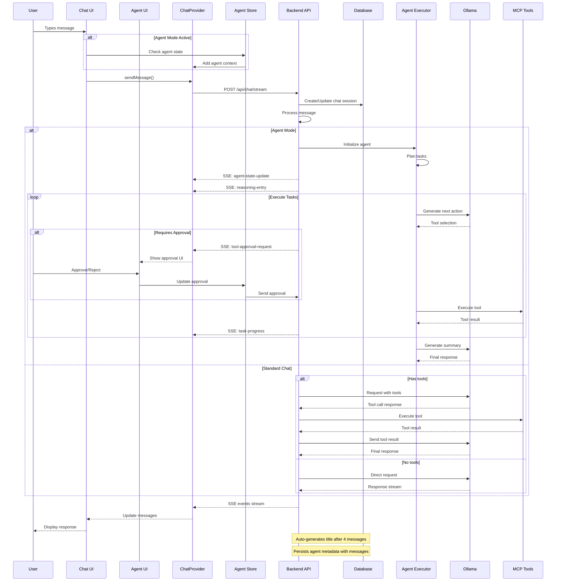
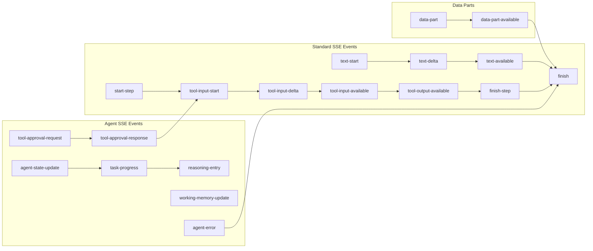

# Archestra AI Chat Architecture

## Overview

This document describes the chat and agent system architecture in Archestra AI, including the request flow, component interactions, agent capabilities, and key design decisions.

## High-Level Architecture



## Request Flow

### 1. Chat Message Flow



### 2. SSE Event Stream Protocol

The backend sends Server-Sent Events (SSE) following the Vercel AI SDK v5 protocol:



## Key Features

### 1. Chat Persistence

- All messages are automatically persisted to SQLite
- Chat sessions are created on first message
- Messages are linked via foreign key with CASCADE delete
- Agent metadata (plan IDs, step IDs, reasoning) persisted with messages

### 2. Streaming Architecture

- Uses Server-Sent Events (SSE) for real-time streaming
- Compatible with Vercel AI SDK v5 protocol
- Supports text streaming and tool execution events
- Extended with agent-specific events for state updates and reasoning
- Data parts for structured agent content (progress, memory, errors)

### 3. Tool Execution (MCP)

- Backend detects and executes MCP tools
- Multi-step tool chains with automatic reflection
- Tool results are streamed back to frontend
- Tools are executed server-side for security
- Agent mode adds:
  - Intelligent tool selection based on capabilities
  - Human-in-the-loop approval for sensitive operations
  - Tool performance tracking and retry strategies
  - Categorized tool security levels

### 4. LLM Integration

- Embedded Ollama instance on port 54588
- Supports multiple models
- Options passed through for response control (temperature, num_predict, etc.)

### 4. Autonomous Agent System

- **Planning Phase**: Breaks down complex tasks into steps
- **Execution Phase**: Executes tasks with tool selection
- **Working Memory**: Maintains context with relevance scoring
- **Reasoning System**: Tracks decisions with confidence scores
- **Error Recovery**: Automatic retry with alternative strategies

### 5. Agent Modes

- `idle`: Agent inactive, standard chat mode
- `initializing`: Agent starting up
- `planning`: Creating task breakdown
- `executing`: Running tasks
- `paused`: User-paused execution
- `completed`: All tasks finished

## Configuration

### URLs and Ports

```typescript
// Frontend configuration (src/consts.ts)
const ARCHESTRA_SERVER_BASE_URL = 'localhost:54587';
const ARCHESTRA_SERVER_BASE_HTTP_URL = `http://${ARCHESTRA_SERVER_BASE_URL}`;

export const ARCHESTRA_SERVER_API_URL = `${ARCHESTRA_SERVER_BASE_HTTP_URL}/api`;
export const ARCHESTRA_SERVER_OLLAMA_PROXY_URL = `${ARCHESTRA_SERVER_BASE_HTTP_URL}/llm/ollama`;
```

### Ollama Configuration

- Embedded instance runs on port 54588
- Not directly exposed to frontend
- All communication goes through backend proxy

## API Endpoints

### Chat Streaming

```
POST /api/chat/stream
Content-Type: application/json

{
  "messages": [...],
  "model": "qwen2.5:3b",
  "tools": ["tool1", "tool2"],
  "stream": true,
  "options": {
    "temperature": 0.7,
    "num_predict": 2048
  },
  "agent_context": {
    "mode": "executing",
    "tools": ["filesystem", "github"],
    "instructions": "Help user with coding tasks",
    "plan_id": "plan_123",
    "step_id": "step_456"
  }
}

Response: Server-Sent Events stream
```

### Chat CRUD Operations

```
GET    /api/chat          - List all chats
POST   /api/chat          - Create new chat
PATCH  /api/chat/{id}     - Update chat (e.g., title)
DELETE /api/chat/{id}     - Delete chat and messages
```

## Security Considerations

1. **Tool Execution**: All MCP tools are executed server-side in sandboxed environments
2. **Database Access**: Frontend never directly accesses the database
3. **LLM Access**: Ollama is not exposed to frontend, only through backend proxy
4. **CORS**: Properly configured for Tauri webview security
5. **Agent Security**:
   - Tool approval system for sensitive operations
   - Categorized security levels for tools
   - Sandboxed agent execution environment
   - Configurable auto-approval lists

## Development Notes

### Adding New Features

1. **New SSE Events**: Update both backend emitter and frontend handler
2. **New Tools**: Register in MCP catalog, backend handles execution automatically
3. **New Models**: Add to Ollama, automatically available in UI
4. **Agent Features**: 
   - Add new agent modes in agent store
   - Extend reasoning types for new decision types
   - Add tool categories in approval system

### Common Issues

1. **CORS Errors**: Ensure URLs include `http://` protocol
2. **Streaming Stops**: Check for unhandled errors in tool execution
3. **Missing Messages**: Verify database persistence in stream handler
4. **Agent Issues**:
   - Agent stuck: Check task timeout settings
   - Tool approval timeout: Verify WebSocket connection
   - Memory overflow: Adjust memory limits in config

## Future Enhancements

1. **WebSocket Support**: For bidirectional communication
2. **Message Editing**: Allow editing previous messages
3. **Export/Import**: Chat history export functionality
4. **Multi-modal**: Image and file support in conversations
5. **Agent Enhancements**:
   - Multi-agent collaboration
   - Long-term memory persistence
   - Custom agent personas
   - Visual task planning interface
   - Agent performance analytics
