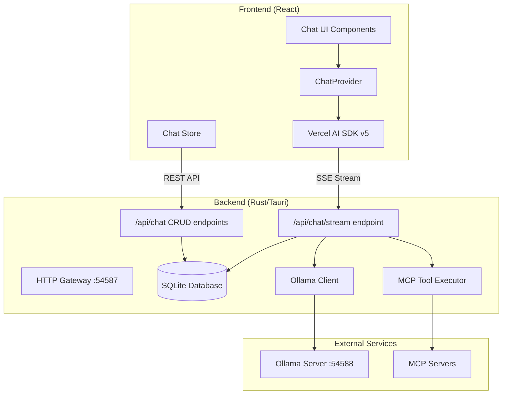
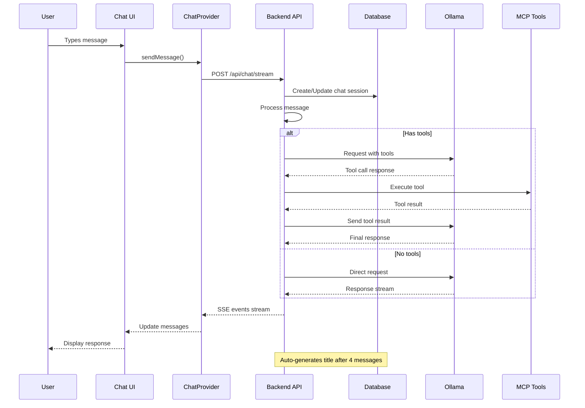
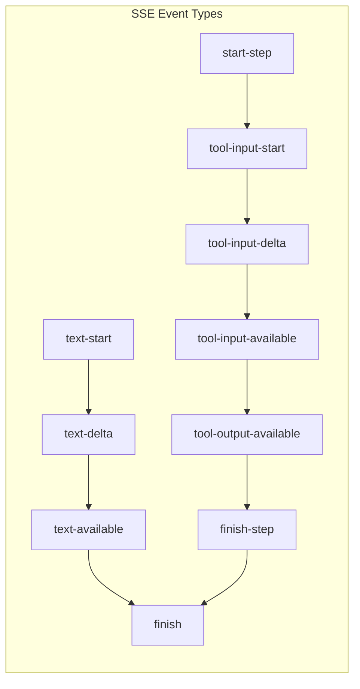

# Archestra AI Chat Architecture

## Overview

This document describes the chat system architecture in Archestra AI, including the request flow, component interactions, and key design decisions.

## High-Level Architecture



## Request Flow

### 1. Chat Message Flow



### 2. SSE Event Stream Protocol

The backend sends Server-Sent Events (SSE) following the Vercel AI SDK v5 protocol:



## Component Details

### Frontend Components

#### ChatProvider (`/src/providers/chat-provider.tsx`)

- Wraps Vercel AI SDK v5's `useChat` hook
- Manages SSE connection to backend
- Handles message streaming and tool execution events
- Provides chat context to all child components

#### Chat UI Components

- **ChatInput**: User message input with model selection
- **ChatHistory**: Displays conversation with streaming support
- **SystemPrompt**: Developer mode system prompt display

#### Chat Store (`/src/stores/chat-store.ts`)

- Manages chat sessions (create, read, update, delete)
- Handles chat list and selection
- Listens for title update events via Tauri events

### Backend Components

#### HTTP Gateway (`/src-tauri/src/gateway/`)

The gateway runs on port 54587 and exposes several endpoints:

```
/api/chat/stream    - SSE streaming for chat conversations
/api/chat          - CRUD operations for chat management
/llm/ollama/*      - Proxy for Ollama operations (models, etc.)
/mcp               - MCP server endpoints
/proxy/:mcp_server - MCP server proxy
```

#### Chat Stream Handler (`/src-tauri/src/gateway/api/chat/mod.rs`)

Core logic for chat processing:

1. Receives messages from frontend
2. Manages chat persistence
3. Handles tool execution with MCP
4. Streams responses using SSE
5. Implements multi-step tool chains

#### Database Models

- **Chat**: Stores chat sessions with metadata
- **ChatMessages**: Individual messages with CASCADE delete
- Automatic title generation after 4 messages

## Key Features

### 1. Chat Persistence

- All messages are automatically persisted to SQLite
- Chat sessions are created on first message
- Messages are linked via foreign key with CASCADE delete

### 2. Streaming Architecture

- Uses Server-Sent Events (SSE) for real-time streaming
- Compatible with Vercel AI SDK v5 protocol
- Supports text streaming and tool execution events

### 3. Tool Execution (MCP)

- Backend detects and executes MCP tools
- Multi-step tool chains with automatic reflection
- Tool results are streamed back to frontend
- Tools are executed server-side for security

### 4. LLM Integration

- Embedded Ollama instance on port 54588
- Supports multiple models
- Options passed through for response control (temperature, num_predict, etc.)

## Configuration

### URLs and Ports

```typescript
// Frontend configuration (src/consts.ts)
const ARCHESTRA_SERVER_BASE_URL = 'localhost:54587';
const ARCHESTRA_SERVER_BASE_HTTP_URL = `http://${ARCHESTRA_SERVER_BASE_URL}`;

export const ARCHESTRA_SERVER_API_URL = `${ARCHESTRA_SERVER_BASE_HTTP_URL}/api`;
export const ARCHESTRA_SERVER_OLLAMA_PROXY_URL = `${ARCHESTRA_SERVER_BASE_HTTP_URL}/llm/ollama`;
```

### Ollama Configuration

- Embedded instance runs on port 54588
- Not directly exposed to frontend
- All communication goes through backend proxy

## API Endpoints

### Chat Streaming

```
POST /api/chat/stream
Content-Type: application/json

{
  "messages": [...],
  "model": "qwen2.5:3b",
  "tools": ["tool1", "tool2"],
  "stream": true,
  "options": {
    "temperature": 0.7,
    "num_predict": 2048
  }
}

Response: Server-Sent Events stream
```

### Chat CRUD Operations

```
GET    /api/chat          - List all chats
POST   /api/chat          - Create new chat
PATCH  /api/chat/{id}     - Update chat (e.g., title)
DELETE /api/chat/{id}     - Delete chat and messages
```

## Security Considerations

1. **Tool Execution**: All MCP tools are executed server-side in sandboxed environments
2. **Database Access**: Frontend never directly accesses the database
3. **LLM Access**: Ollama is not exposed to frontend, only through backend proxy
4. **CORS**: Properly configured for Tauri webview security

## Development Notes

### Adding New Features

1. **New SSE Events**: Update both backend emitter and frontend handler
2. **New Tools**: Register in MCP catalog, backend handles execution automatically
3. **New Models**: Add to Ollama, automatically available in UI

### Common Issues

1. **CORS Errors**: Ensure URLs include `http://` protocol
2. **Streaming Stops**: Check for unhandled errors in tool execution
3. **Missing Messages**: Verify database persistence in stream handler

## Future Enhancements

1. **WebSocket Support**: For bidirectional communication
2. **Message Editing**: Allow editing previous messages
3. **Export/Import**: Chat history export functionality
4. **Multi-modal**: Image and file support in conversations
