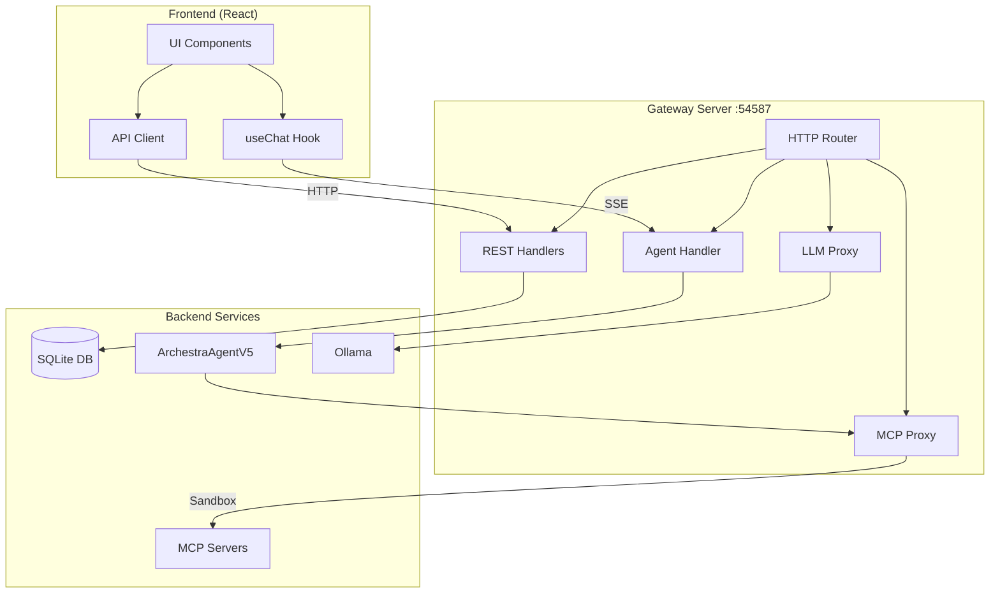

# Communication Architecture

This document describes how different components communicate within the Archestra AI desktop application.

## Overview

Archestra AI uses a centralized HTTP gateway architecture, moving away from traditional Tauri IPC commands to provide a unified API surface. All communication between the frontend and backend services flows through a single gateway server.

## Gateway Server

The gateway server runs on port **54587** and is the single point of communication for all services.

```
Base URL: http://localhost:54587 (ARCHESTRA_SERVER_BASE_URL)
```

### Available Routes

```
http://localhost:54587/
├── /api/                    # REST API endpoints
│   ├── /external_mcp_client # External MCP client management
│   ├── /mcp_request_log     # Request logging and analytics
│   ├── /mcp_server          # MCP server configuration
│   └── /agent/              # AI Agent endpoints
│       └── /chat            # SSE streaming for agent chat
├── /mcp_proxy/{server}      # Proxy to MCP servers in sandbox
├── /llm/{provider}          # LLM provider proxy (e.g., /llm/ollama)
└── /mcp                     # Archestra MCP server (streamable HTTP)
```

## Communication Patterns

### 1. REST API Communication

Standard HTTP requests for CRUD operations and synchronous actions.

```typescript
// Frontend example
import { apiClient } from '@/lib/api-client';

// List MCP servers
const servers = await apiClient.mcp_server.list();

// Create external MCP client
const client = await apiClient.external_mcp_client.create({
  name: "My Client",
  config: { ... }
});
```

### 2. SSE (Server-Sent Events) for Agent Chat

Real-time streaming communication for AI agent interactions using Vercel AI SDK v5 protocol.

```typescript
// Frontend usage with useChat hook
import { useChat } from '@ai-sdk/react';

const { messages, append, isLoading } = useChat({
  api: '/api/agent/chat', // Resolves to http://localhost:54587/api/agent/chat
});
```

**SSE Event Types:**

- `message_start` - Initial message metadata
- `content_delta` - Streaming text chunks
- `tool_call_start` - Tool execution begins
- `tool_call_result` - Tool execution result
- `data_part` - Custom data (reasoning, progress)
- `message_complete` - Final message with usage stats
- `ping` - Keepalive events

### 3. MCP Server Proxy Communication

Proxies requests to MCP (Model Context Protocol) servers running in sandboxed environments.

```typescript
// MCP tool execution flow
POST http://localhost:54587/mcp_proxy/filesystem-server
Content-Type: application/json

{
  "jsonrpc": "2.0",
  "method": "tools/call",
  "params": {
    "name": "read_file",
    "arguments": { "path": "/tmp/data.txt" }
  }
}
```

### 4. LLM Provider Proxy

Forwards requests to LLM providers (currently Ollama) with streaming support.

```typescript
// Ollama API proxy
POST http://localhost:54587/llm/ollama/api/generate
Content-Type: application/json

{
  "model": "llama3.2",
  "prompt": "Hello, world!",
  "stream": true
}
```

## Architecture Diagram



## Security Considerations

### CORS Configuration

All endpoints include proper CORS headers:

```
Access-Control-Allow-Origin: *
Access-Control-Allow-Methods: GET, POST, PUT, DELETE, OPTIONS
Access-Control-Allow-Headers: Content-Type, Authorization
```

### Sandbox Isolation

MCP servers run in macOS sandbox environments with restricted permissions:

- Limited file system access
- No network access (unless explicitly allowed)
- Process isolation

### Authentication Flow

OAuth tokens for external services flow through:

1. Frontend initiates OAuth
2. Backend OAuth proxy handles redirect
3. Tokens stored securely in SQLite
4. Tokens used for MCP server authentication

## Migration from Tauri IPC

This project has migrated from traditional Tauri IPC commands to HTTP-based communication for:

1. **Unified API Surface**: Single API can serve desktop, web, and mobile clients
2. **Standard Tooling**: HTTP/REST/SSE have excellent debugging and monitoring tools
3. **Type Safety**: OpenAPI schema generates TypeScript clients automatically
4. **Scalability**: Easier to scale and distribute services

### Legacy IPC Pattern (No Longer Used)

```typescript
// OLD: Direct Tauri commands
import { invoke } from '@tauri-apps/api/tauri';

const result = await invoke('get_mcp_servers');
```

### Current HTTP Pattern

```typescript
// NEW: HTTP API client
import { apiClient } from '@/lib/api-client';

const result = await apiClient.mcp_server.list();
```

## Error Handling

All API endpoints return consistent error responses:

```json
{
  "error": {
    "code": "RESOURCE_NOT_FOUND",
    "message": "MCP server not found",
    "details": { ... }
  }
}
```

SSE streams handle errors through:

- Error events in the stream
- Automatic reconnection (client-side)
- Timeout detection

## Performance Considerations

1. **Connection Pooling**: Reuse HTTP connections
2. **Streaming**: Use SSE for real-time updates instead of polling
3. **Compression**: Enable gzip for large responses
4. **Caching**: Client-side caching for static resources

## Future Enhancements

1. **WebSocket Support**: For bidirectional real-time communication
2. **GraphQL Gateway**: For more flexible data fetching
3. **Request Batching**: Combine multiple API calls
4. **Rate Limiting**: Prevent resource exhaustion
5. **Metrics Collection**: OpenTelemetry integration

## Related Documentation

- [MCP Protocol](./mcp-protocol.md) - Details on Model Context Protocol
- [Agent Architecture](./agent-architecture.md) - AI agent implementation details
- [API Reference](http://localhost:54587/api/docs) - OpenAPI documentation (when running)
