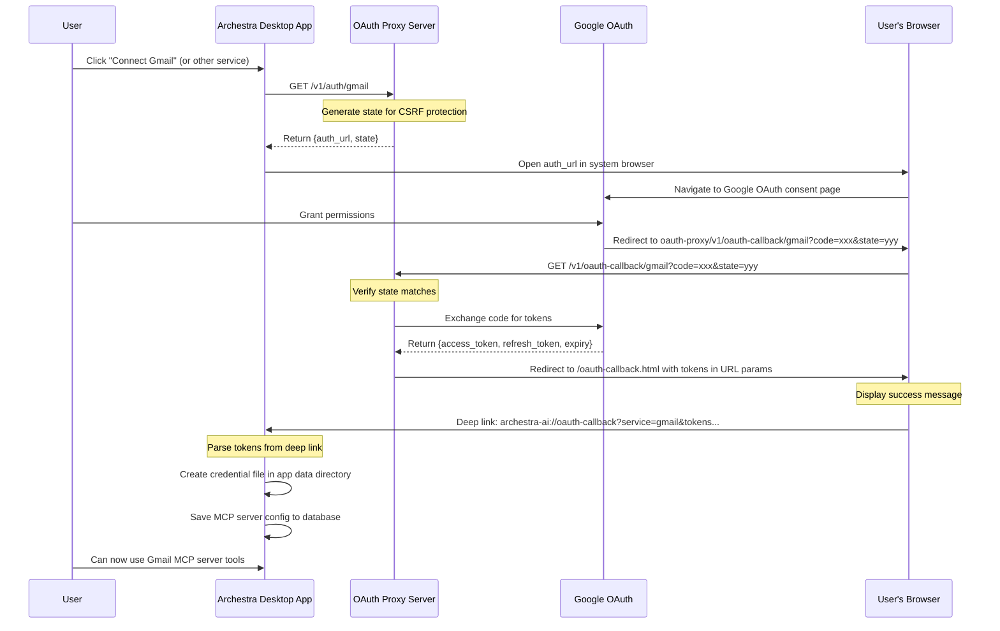

# OAuth Proxy Service

A secure OAuth proxy service that handles OAuth authentication flows for MCP (Model Context Protocol) servers in the Archestra desktop application. This service facilitates OAuth 2.0 authentication for various Google Workspace services without exposing sensitive credentials to the client application.

## Overview

The OAuth proxy acts as an intermediary between the Archestra desktop application and OAuth providers (currently Google). It manages the OAuth flow, exchanges authorization codes for tokens, and securely passes credentials back to the desktop application via deep links.

## Supported Services

Currently supports OAuth authentication for the following Google services:

- Gmail (`gmail`)
- Google Drive (`google-drive`)
- Google Calendar (`google-calendar`)
- Google Docs (`google-docs`)
- Google Sheets (`google-sheets`)
- Google Slides (`google-slides`)
- Google Forms (`google-forms`)
- Google Tasks (`google-tasks`)
- Google Chat (`google-chat`)

## OAuth Flow

The complete OAuth flow involves interactions between the Archestra desktop app, the OAuth proxy server, Google's OAuth service, and the user's browser:



## API Endpoints

### `GET /health`

Health check endpoint.

**Response:**

```json
{
  "status": "ok",
  "timestamp": "2024-01-01T00:00:00.000Z"
}
```

### `GET /v1/auth/:service`

Initiates OAuth flow for the specified service.

**Parameters:**

- `service` - The OAuth service identifier (e.g., `gmail`, `google-drive`)
- `userId` (optional query param) - User identifier for state tracking

**Response:**

```json
{
  "auth_url": "https://accounts.google.com/o/oauth2/v2/auth?...",
  "state": "random-state-string"
}
```

### `GET /v1/oauth-callback/:service`

Handles OAuth callback from the provider.

**Parameters:**

- `service` - The OAuth service identifier
- `code` - Authorization code from OAuth provider
- `state` - State parameter for CSRF protection

**Response:**
Redirects to `/oauth-callback.html` with tokens in URL parameters, which then triggers a deep link to the desktop app.

## Development

### Prerequisites

- Node.js 24.4.1
- pnpm 10.13.1

### Setup

```bash
# Install dependencies
pnpm install

# Set up environment variables
cp .env.example .env
# Edit .env to add:
# - GOOGLE_CLIENT_ID
# - GOOGLE_CLIENT_SECRET
# - PORT (default: 3000)
# - REDIRECT_URL (for production)
```

### Running Locally

```bash
# Development mode with hot reload
pnpm dev

# Build TypeScript
pnpm build

# Production mode
pnpm start

# Run tests
pnpm test

# Type checking
pnpm typecheck
```

## Deployment

The service is deployed to Google Cloud Run via GitHub Actions:

- **Development**: Automatically deployed on commits to `main` that modify oauth-proxy files
- **Production**: Deployed when a new release is created via release-please

See deployment configuration:

- [Deployment workflow](.github/workflows/deploy-oauth-proxy-server-to-cloud-run.yml)
- [On commits to main](.github/workflows/on-commits-to-main.yml)
- [Release workflow](.github/workflows/release-please.yml)

## Security Considerations

1. **CSRF Protection**: State parameter is used to prevent CSRF attacks
2. **HTTPS Only**: In production, all communication must be over HTTPS
3. **Token Storage**: Tokens are never stored on the proxy server
4. **Deep Links**: Tokens are passed via secure deep links to the desktop app
5. **Environment Variables**: Sensitive credentials are stored as environment variables

## Adding New OAuth Services

To add support for a new OAuth service:

1. Add the service to the `OAuthService` type in `src/types.ts`
2. Implement the service handler interface in a new file (e.g., `src/microsoft.ts`)
3. Add service routing in `src/v1/handlers.ts`
4. Add OAuth scopes configuration
5. Update the supported services list in documentation

## Architecture

The service is built with:

- **TypeScript**: For type safety and better developer experience
- **Express**: Web framework for handling HTTP requests
- **Winston**: Structured logging
- **Vitest**: Testing framework
- **Google Auth Library**: For Google OAuth implementation

## Monitoring

The service logs all requests and OAuth flow events using Winston. In production, logs are written to:

- `error.log`: Error-level logs
- `combined.log`: All logs (info level and above)
- Console output: All logs with color formatting
