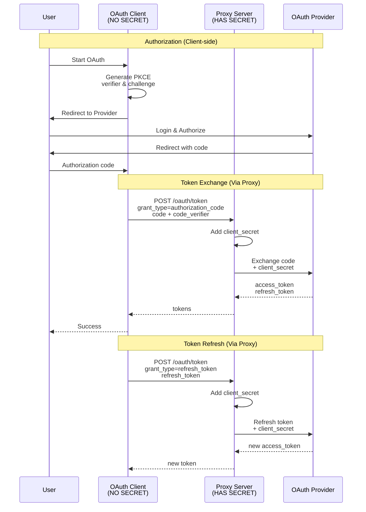

# OAuth Proxy Server

A secure, minimalistic OAuth proxy server built with Fastify that handles PKCE-based OAuth flows. The proxy adds client secrets server-side, keeping them secure while allowing public clients to complete OAuth flows.

## Architecture

The proxy acts as a secure middleware between OAuth clients (without secrets) and OAuth providers:



## Features

- 🔐 **Secure**: Client secrets never exposed to frontend
- 🚀 **Fast**: Built with Fastify for high performance
- 🔌 **Extensible**: Easy to add new OAuth providers
- 🛡️ **PKCE Support**: Full support for PKCE flow
- 🔒 **HTTPS**: Local HTTPS support with mkcert
- 📝 **Simple**: Minimal dependencies, clean architecture

## Installation

```bash
# Install dependencies
pnpm install

# Copy environment variables
cp .env.example .env

# Edit .env with your OAuth credentials
```

## Configuration

Edit `.env` file with your OAuth credentials:

```env
# Server
PORT=8080
USE_LOCAL_HTTPS=true
LOG_LEVEL=info

# CORS
CORS_ORIGIN=http://localhost:3000,https://localhost:3000

# Google OAuth
GOOGLE_CLIENT_ID=your_client_id
GOOGLE_CLIENT_SECRET=your_client_secret

# Slack OAuth
SLACK_CLIENT_ID=your_client_id
SLACK_CLIENT_SECRET=your_client_secret
```

## Running the Server

### Development
```bash
pnpm dev
```

### Production
```bash
pnpm start
```

### With HTTPS (Local Development)

1. Install mkcert:
```bash
brew install mkcert
mkcert -install
```

2. Generate certificates:
```bash
cd oauth_proxy
mkcert localhost
```

3. Set in `.env`:
```env
USE_LOCAL_HTTPS=true
```

4. Run the server:
```bash
pnpm start
```

## API Endpoints

### `POST /oauth/token`

Exchange authorization code or refresh token for access token.

**Request Body:**
```json
{
  "grant_type": "authorization_code",
  "provider": "google",
  "code": "authorization_code_from_provider",
  "code_verifier": "pkce_code_verifier",
  "redirect_uri": "https://yourapp.com/callback"
}
```

**For token refresh:**
```json
{
  "grant_type": "refresh_token",
  "provider": "google",
  "refresh_token": "refresh_token_from_provider"
}
```

**Response:**
```json
{
  "access_token": "...",
  "token_type": "Bearer",
  "expires_in": 3600,
  "refresh_token": "...",
  "scope": "..."
}
```

### `POST /oauth/revoke`

Revoke an access or refresh token.

**Request Body:**
```json
{
  "provider": "google",
  "token": "token_to_revoke"
}
```

### `GET /health`

Health check endpoint.

### `GET /callback/:provider`

OAuth callback endpoint that redirects back to the desktop app with authorization code.

### `GET /`

API documentation and configured providers list.

## Adding New Providers

Adding a new OAuth provider is straightforward:

### 1. Add Configuration

Add to `.env`:
```env
GITHUB_CLIENT_ID=your_client_id
GITHUB_CLIENT_SECRET=your_client_secret
```

### 2. Update Config

Edit `src/config/index.js`:
```javascript
providers: {
  // ... existing providers
  
  github: {
    clientId: process.env.GITHUB_CLIENT_ID,
    clientSecret: process.env.GITHUB_CLIENT_SECRET,
    tokenEndpoint: 'https://github.com/login/oauth/access_token',
    revokeEndpoint: null, // if supported
  },
}
```

### 3. Create Provider Class (Optional)

For standard OAuth2 providers, no custom class needed. For providers with special requirements, create `src/providers/github.js`:

```javascript
import { OAuthProvider } from './base.js';

export class GitHubOAuthProvider extends OAuthProvider {
  // Override methods if needed
  prepareTokenRequest(baseParams, originalParams) {
    // Add GitHub-specific parameters
    return {
      ...baseParams,
      // custom params
    };
  }
}
```

### 4. Register Provider

In `src/providers/index.js`:
```javascript
import { GitHubOAuthProvider } from './github.js';

// In initializeProviders()
if (config.providers.github.clientId && config.providers.github.clientSecret) {
  providers.set('github', new GitHubOAuthProvider(config.providers.github));
}
```

## Client Integration Example

### JavaScript/TypeScript

```javascript
// 1. Start OAuth flow (client-side)
const codeVerifier = generateCodeVerifier();
const codeChallenge = await generateCodeChallenge(codeVerifier);

// Redirect to provider
window.location.href = `https://accounts.google.com/o/oauth2/v2/auth?${params}`;

// 2. After redirect back with code
const response = await fetch('https://localhost:8080/oauth/token', {
  method: 'POST',
  headers: { 'Content-Type': 'application/json' },
  body: JSON.stringify({
    grant_type: 'authorization_code',
    provider: 'google',
    code: authorizationCode,
    code_verifier: codeVerifier,
    redirect_uri: redirectUri,
  }),
});

const tokens = await response.json();
```

## Security Considerations

1. **Client Secrets**: Never expose client secrets to frontend code
2. **HTTPS**: Always use HTTPS in production
3. **CORS**: Configure allowed origins properly
4. **State Parameter**: Use state parameter to prevent CSRF attacks
5. **PKCE**: Always use PKCE for public clients

## Docker Support

```dockerfile
FROM node:20-alpine
WORKDIR /app
COPY package*.json ./
RUN npm ci --only=production
COPY . .
EXPOSE 8080
CMD ["node", "src/server.js"]
```

## Production Deployment

For production, consider:
- Use environment variables for all secrets
- Enable HTTPS with proper certificates
- Configure CORS for your domains
- Add rate limiting
- Add monitoring/logging service
- Use a process manager like PM2

## License

MIT